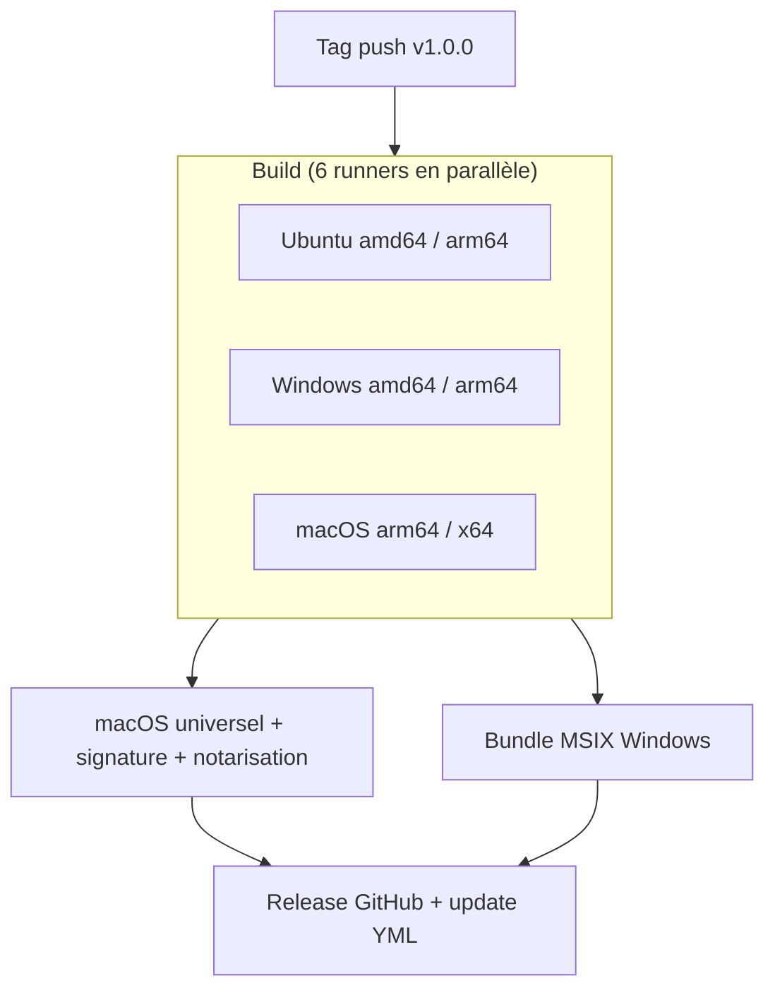

import { Callout } from 'fumadocs-ui/components/callout';

Dans ce tutoriel, tu mets en place une pipeline de release GitHub Actions pour une application
desktop Nucleus. Tu construis les installateurs sur une matrice par OS et par architecture, tu
fusionnes les builds macOS en un binaire universel, tu regroupes les builds Windows pour le
Microsoft Store, tu génères les métadonnées de mise à jour, puis tu publies le tout dans une
release GitHub.

Nucleus livre six actions composites dans le dépôt
[`NucleusFramework/Nucleus`](https://github.com/NucleusFramework/Nucleus). Tu les référence par
leur chemin depuis ton propre workflow — il n'y a rien à copier dans ton projet.

## Avant de commencer

- Ton projet est hébergé sur GitHub et applique le plugin Gradle Nucleus. Voir
  [Démarrage rapide](/docs/start/quickstart).
- Le workflow de release a besoin de `permissions: contents: write` pour créer des releases et
  téléverser des assets.
- Les installateurs ne sont pas compilés de manière croisée. Chaque couple OS/architecture doit
  être construit sur un runner correspondant.

<Callout type="info">
Les actions composites s'adressent sous la forme
`NucleusFramework/Nucleus/.github/actions/<name>@<ref>`. Utilise `@main` pendant tes essais et
épingle un tag comme `@v2.0.0` pour la production.
</Callout>

## Référencer une action

Ajoute une étape qui pointe vers une action du dépôt Nucleus :

```yaml
- uses: NucleusFramework/Nucleus/.github/actions/setup-nucleus@main
```

Les six actions sont :

| Action | Rôle |
|--------|------|
| `setup-nucleus` | Installe le JBR (ou GraalVM Liberica NIK), les outils de packaging Linux, Gradle et Node. |
| `setup-macos-signing` | Crée un keychain temporaire et importe un certificat `.p12` pour `codesign`. |
| `build-macos-universal` | Fusionne les bundles `.app` arm64 et x64 avec `lipo`, re-signe et réempaquette en ZIP, DMG et PKG. |
| `build-windows-appxbundle` | Combine les fichiers `.appx` amd64 et arm64 en un `.msixbundle` et le signe. |
| `generate-update-yml` | Calcule les empreintes SHA-512 et émet les métadonnées `latest-*.yml` lues par l'auto-updater. |
| `publish-release` | Crée la release GitHub via `gh release create` et téléverse les installateurs et le YAML. |

## Construire sur chaque plateforme

Crée `.github/workflows/release.yaml`. Déclenche sur les tags de version, exécute une matrice sur
les six runners, prépare l'environnement avec `setup-nucleus`, empaquette pour l'OS courant et
téléverse le résultat en artefact :

```yaml title=".github/workflows/release.yaml"
name: Release
on:
  push:
    tags: ['v*']

permissions:
  contents: write

jobs:
  build:
    strategy:
      fail-fast: false
      matrix:
        include:
          - { os: ubuntu-latest,    arch: amd64 }
          - { os: ubuntu-24.04-arm, arch: arm64 }
          - { os: windows-latest,   arch: amd64 }
          - { os: windows-11-arm,   arch: arm64 }
          - { os: macos-latest,     arch: arm64 }
          - { os: macos-15-intel,   arch: amd64 }
    runs-on: ${{ matrix.os }}
    steps:
      - uses: actions/checkout@v4
      - uses: NucleusFramework/Nucleus/.github/actions/setup-nucleus@main
        with:
          jbr-version: '25.0.2b329.66'
          packaging-tools: 'true'
          flatpak: 'true'
          snap: 'true'
      - run: ./gradlew packageReleaseDistributionForCurrentOS --stacktrace --no-daemon
      - uses: actions/upload-artifact@v4
        with:
          name: release-assets-${{ runner.os }}-${{ matrix.arch }}
          path: build/compose/binaries/main/**/*
```

Les jobs suivants téléchargent ces artefacts par leur nom `release-assets-<os>-<arch>` : conserve
donc ce schéma de nommage.

## Préparer l'environnement de build

`setup-nucleus` provisionne toute la toolchain en une étape. Sur Linux avec
`packaging-tools: 'true'`, il installe `xvfb`, `rpm`, `fakeroot`, `libarchive-tools`,
`libdbus-1-dev`, `libglib2.0-dev`, `libx11-dev`, `libgtk-3-dev` et `patchelf`, puis démarre un
affichage virtuel. Il configure aussi Gradle avec cache et installe Node pour electron-builder.

Entrées :

| Entrée | Défaut | Rôle |
|--------|--------|------|
| `jbr-version` | `25.0.2b329.66` | Version du JetBrains Runtime à installer. |
| `jbr-variant` | `jbrsdk` | Variante du JBR (`jbrsdk`, `jbrsdk_jcef`, …). |
| `jbr-download-url` | — | Remplace l'URL de téléchargement complète du JBR. |
| `packaging-tools` | `true` | Installe les outils de packaging Linux (Linux uniquement). |
| `flatpak` | `false` | Installe Flatpak et le Freedesktop Platform/SDK 24.08 (Linux uniquement). |
| `snap` | `false` | Installe snapd et Snapcraft (Linux uniquement). |
| `graalvm` | `false` | Utilise GraalVM (Liberica NIK) au lieu du JBR. |
| `graalvm-java-version` | `25` | Version Java de GraalVM. |
| `setup-gradle` | `true` | Configure Gradle via `gradle/actions/setup-gradle`. |
| `setup-node` | `true` | Configure Node.js. |
| `node-version` | `24` | Version de Node.js. |

Avec `graalvm: 'true'`, l'action installe Liberica NIK à la place du JBR, sélectionne Xcode 26 sur
macOS et configure MSVC sur Windows via `ilammy/msvc-dev-cmd@v1`.

## Signer les builds macOS

`setup-macos-signing` décode un `.p12` en base64, l'importe dans un keychain temporaire et le
déverrouille pour `codesign`. Il expose le chemin du keychain en sortie, consommé par
`build-macos-universal` :

```yaml
- uses: NucleusFramework/Nucleus/.github/actions/setup-macos-signing@main
  id: signing
  with:
    certificate-base64: ${{ secrets.MAC_CERTIFICATES_P12 }}
    certificate-password: ${{ secrets.MAC_CERTIFICATES_PASSWORD }}
```

La signature et la notarisation macOS bout-en-bout utilisent ces secrets de dépôt :

| Secret | Rôle |
|--------|------|
| `MAC_CERTIFICATES_P12` | Bundle `.p12` encodé en base64. |
| `MAC_CERTIFICATES_PASSWORD` | Mot de passe du `.p12`. |
| `MAC_DEVELOPER_ID_APPLICATION` | Identité Developer ID Application (DMG/ZIP). |
| `MAC_APP_STORE_APPLICATION` | Identité 3rd Party Mac Developer Application (PKG sandboxé). |
| `MAC_APP_STORE_INSTALLER` | Identité 3rd Party Mac Developer Installer (PKG). |
| `MAC_PROVISIONING_PROFILE` | Provisioning profile de l'app sandboxée, en base64. |
| `MAC_RUNTIME_PROVISIONING_PROFILE` | Provisioning profile du runtime JVM, en base64. |
| `MAC_NOTARIZATION_APPLE_ID`, `MAC_NOTARIZATION_PASSWORD`, `MAC_NOTARIZATION_TEAM_ID` | Identifiants `notarytool`. |

<Callout type="info">
Sans les secrets `MAC_*`, la pipeline retombe sur une signature ad-hoc — le même résultat qu'un
build local non signé. Voir [Signature de code](/docs/packaging/code-signing) pour produire et
stocker chaque secret.
</Callout>

## Fusionner le binaire macOS universel

`build-macos-universal` prend les bundles `.app` par architecture, fusionne chaque binaire Mach-O
avec `lipo`, re-signe le résultat de l'intérieur vers l'extérieur (fichiers `.dylib` et `.jnilib`
d'abord, avec les entitlements du runtime, puis les exécutables, puis le runtime, puis le bundle)
et réempaquette un ZIP, un DMG et un PKG universels :

```yaml
- uses: NucleusFramework/Nucleus/.github/actions/build-macos-universal@main
  with:
    arm64-path: artifacts/release-assets-macOS-arm64
    x64-path: artifacts/release-assets-macOS-amd64
    output-path: artifacts/release-assets-macOS-universal
    signing-identity: ${{ secrets.MAC_DEVELOPER_ID_APPLICATION }}
    app-store-identity: ${{ secrets.MAC_APP_STORE_APPLICATION }}
    installer-identity: ${{ secrets.MAC_APP_STORE_INSTALLER }}
    keychain-path: ${{ steps.signing.outputs.keychain-path }}
```

La notarisation s'exécute dans des étapes de workflow séparées avec
`xcrun notarytool submit --wait`. Le DMG est staplé ; le ZIP est notarisé mais pas staplé, pour
qu'un réempaquetage n'invalide jamais le blockmap dont dépend
l'[auto-updater](/docs/packaging/auto-update).

<Callout type="warn">
Sur les dépôts **privés**, les runners macOS sont facturés avec un multiplicateur de 10× sur ton
quota mensuel de minutes, et `--wait` garde le runner actif pendant qu'il interroge le service de
notarisation d'Apple — tu paies ce temps d'attente au tarif macOS. Les dépôts publics sont
gratuits. Pour réduire les coûts sur un dépôt privé, exécute les étapes de signature et de
notarisation sur un runner macOS auto-hébergé, dont GitHub ne facture pas les minutes.
</Callout>

## Regrouper Windows pour le Microsoft Store

`build-windows-appxbundle` combine les fichiers `.appx` amd64 et arm64 en un seul `.msixbundle`
avec `MakeAppx`, puis le signe avec SignTool — un artefact unique pour la soumission au Store :

```yaml
- uses: NucleusFramework/Nucleus/.github/actions/build-windows-appxbundle@main
  with:
    amd64-path: artifacts/release-assets-Windows-amd64
    arm64-path: artifacts/release-assets-Windows-arm64
    output-path: artifacts/release-assets-Windows-bundle
```

## Générer les métadonnées de mise à jour

`generate-update-yml` parcourt chaque installateur téléchargé, calcule son SHA-512 et écrit un
fichier YAML par plateforme. Le canal détermine le préfixe du nom de fichier — `latest`, `beta`
ou `alpha` — produisant `<channel>-mac.yml`, `<channel>.yml` (Windows) et `<channel>-linux.yml` :

```yaml
- uses: NucleusFramework/Nucleus/.github/actions/generate-update-yml@main
  with:
    artifacts-path: artifacts
    version: ${{ env.VERSION }}
    channel: ${{ env.CHANNEL }}
```

## Publier la release

`publish-release` lance `gh release create` avec le tag, téléverse les installateurs et le YAML,
puis applique le type de release. Passe `prerelease` pour marquer la release comme pré-release :

```yaml
- uses: NucleusFramework/Nucleus/.github/actions/publish-release@main
  with:
    artifacts-path: artifacts
    tag: ${{ env.TAG }}
    release-type: ${{ env.RELEASE_TYPE }}
```

## Utiliser le workflow de référence

Le dépôt Nucleus livre une pipeline complète qui relie les six actions, dans
[`.github/workflows/release-desktop.yaml`](https://github.com/NucleusFramework/Nucleus/blob/main/.github/workflows/release-desktop.yaml).
Elle construit la matrice, puis se ramifie en un job macOS universel et un job de bundle Windows
avant de publier :



Ce workflow marque une release comme pré-release quand la version contient `-alpha` ou `-beta`, et
sélectionne le canal de mise à jour correspondant. Une étape `validate-release-ref` distincte
impose que les tags `v2.x.y-alpha`, `-beta` et `-rc` pointent sur un commit de la branche
`nucleus-2.0`.

## Et ensuite

- [Signature de code](/docs/packaging/code-signing) — produire et stocker les secrets de signature macOS, Windows et Linux.
- [Publication](/docs/packaging/publishing) — le DSL `publish { }` qui pilote les cibles GitHub, S3 et generic.
- [Auto-update](/docs/packaging/auto-update) — comment le client consomme les métadonnées `latest-*.yml` générées.
