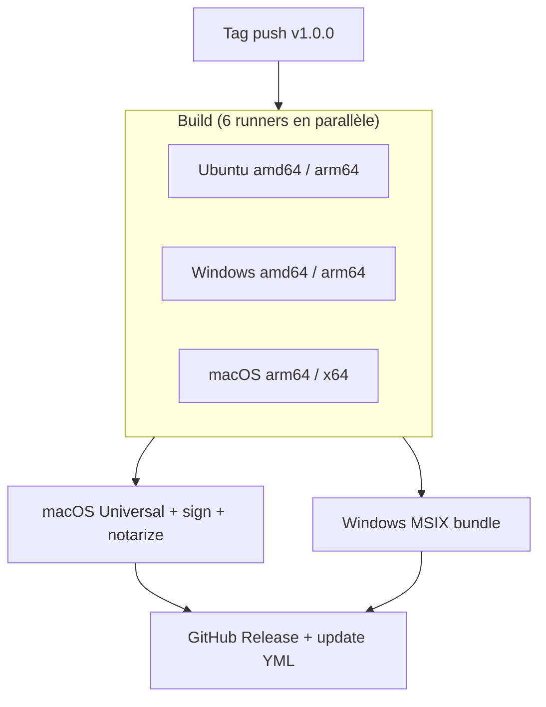

import { Callout } from 'fumadocs-ui/components/callout';

Construire, signer et publier sur trois OS et quatre architectures à la main, c'est un job à temps plein. Nucleus livre six actions composites GitHub Actions qui gèrent toute la pipeline — et un workflow de release de référence que tu peux `uses:` directement depuis le repo Nucleus, sans copier-coller.

## TL;DR
- `setup-nucleus` — JBR 25 (ou GraalVM Liberica NIK), outils de packaging, Gradle, Node, cross-platform.
- `setup-macos-signing` — keychain temporaire + import de certificats depuis secrets.
- `build-macos-universal` — fusion `lipo` arm64 + x64, re-signature inside-out, notarisation, staple.
- `build-windows-appxbundle` — combine `.appx` amd64 + arm64 en `.msixbundle`, signe avec SignTool.
- `generate-update-yml` — scanne tous les installateurs, calcule SHA-512, émet `latest-*.yml`.
- `publish-release` — `gh release create` avec installateurs + YAML.

## Installation
Référence les actions directement depuis le repo Nucleus :

```yaml
- uses: NucleusFramework/Nucleus/.github/actions/setup-nucleus@main
```

Pin sur un tag (`@v2.0.0`) en prod.

## Démarrage rapide

```yaml
name: Release
on:
  push:
    tags: ['v*']

permissions:
  contents: write

jobs:
  build:
    strategy:
      matrix:
        include:
          - { os: ubuntu-latest,   arch: amd64 }
          - { os: ubuntu-24.04-arm, arch: arm64 }
          - { os: windows-latest,   arch: amd64 }
          - { os: windows-11-arm,   arch: arm64 }
          - { os: macos-latest,     arch: arm64 }
          - { os: macos-15-intel,   arch: amd64 }
    runs-on: ${{ matrix.os }}
    steps:
      - uses: actions/checkout@v4
      - uses: NucleusFramework/Nucleus/.github/actions/setup-nucleus@main
        with:
          jbr-version: '25.0.2b329.66'
          packaging-tools: 'true'
          flatpak: 'true'
          snap: 'true'
      - run: ./gradlew packageReleaseDistributionForCurrentOS --stacktrace --no-daemon
      - uses: actions/upload-artifact@v4
        with:
          name: release-assets-${{ runner.os }}-${{ matrix.arch }}
          path: build/compose/binaries/main/**/*
```

## Comment ça marche

### `setup-nucleus`
Environnement cross-platform en une étape. Installe JBR (défaut) ou Liberica NIK (pour GraalVM), les outils de packaging Linux (`xvfb`, `rpm`, `fakeroot`, `patchelf`, `libx11-dev`, `libdbus-1-dev`), Flatpak SDK + runtime (optionnel), Snapcraft (optionnel), Gradle avec cache, Node (pour electron-builder).

Inputs : `jbr-version`, `jbr-variant`, `jbr-download-url`, `graalvm` (booléen), `graalvm-java-version`, `packaging-tools`, `flatpak`, `snap`, `setup-gradle`, `setup-node`, `node-version`.

Le mode GraalVM (`graalvm: 'true'`) remplace JBR par Liberica NIK 25, sélectionne Xcode 26 sur macOS et installe MSVC sur Windows via `ilammy/msvc-dev-cmd@v1`.

### `setup-macos-signing`
Importe un `.p12` encodé en base64 dans un keychain temporaire et le déverrouille pour `codesign`. Sort les identités que l'action universal-binary consomme.

```yaml
- uses: NucleusFramework/Nucleus/.github/actions/setup-macos-signing@main
  with:
    certificate-base64: ${{ secrets.MAC_CERTIFICATES_P12 }}
    certificate-password: ${{ secrets.MAC_CERTIFICATES_PASSWORD }}
```

Secrets requis pour la signature macOS bout-en-bout :

| Secret | Rôle |
|--------|------|
| `MAC_CERTIFICATES_P12` | Bundle `.p12` encodé en base64 |
| `MAC_CERTIFICATES_PASSWORD` | Mot de passe du `.p12` |
| `MAC_DEVELOPER_ID_APPLICATION` | Identité Developer ID Application |
| `MAC_APP_STORE_APPLICATION` | Identité 3rd Party Mac Developer Application |
| `MAC_APP_STORE_INSTALLER` | Identité 3rd Party Mac Developer Installer |
| `MAC_PROVISIONING_PROFILE` | Provisioning profile sandboxé en base64 |
| `MAC_RUNTIME_PROVISIONING_PROFILE` | Provisioning profile runtime JVM en base64 |
| `MAC_NOTARIZATION_APPLE_ID` / `_PASSWORD` / `_TEAM_ID` | Credentials de notarisation |

### `build-macos-universal`
Prend les `.app` par arch, fusionne avec `lipo`, re-signe inside-out (`.dylib` et `.jnilib` d'abord avec runtime entitlements, puis exécutables principaux avec app entitlements, puis runtime, puis le bundle), notarise via `xcrun notarytool`, staple. Produit un seul `MyApp-1.0.0-macos-universal.dmg` et un ZIP staplé. Sans les secrets `MAC_*` le workflow fait fallback sur de la signature ad-hoc — même résultat qu'un build local non signé.

### `build-windows-appxbundle`
Combine les `.appx` amd64 et arm64 en `.msixbundle` via `MakeAppx`, puis signe avec SignTool. Artefact unique pour la soumission Microsoft Store.

### `generate-update-yml`
Parcourt chaque installateur uploadé, calcule SHA-512, produit `latest-mac.yml`, `latest.yml` (Windows), `latest-linux.yml`. Fusionne les artefacts par architecture en un YAML unique par plateforme — l'[auto-updater](/docs/packaging/auto-update) les consomme.

### `publish-release` (Release)
Lance `gh release create` avec le tag de version, les installateurs assemblés et les YAML. Marque pre-release automatiquement pour les tags `*-alpha-*` / `*-beta-*`.

### Forme du workflow de release de référence



Le workflow complet vit dans [`.github/workflows/release-desktop.yaml`](https://github.com/NucleusFramework/Nucleus/blob/main/.github/workflows/release-desktop.yaml) du repo Nucleus. `[FACT-CHECK NEEDED]` — confirme les chemins exacts des actions et les noms de secrets requis par rapport aux actions livrées en 2.0.

## Référence

| Action | Rôle |
|--------|------|
| `setup-nucleus` | JBR/Liberica + outils + Gradle + Node |
| `setup-macos-signing` | Keychain temporaire depuis P12 base64 |
| `build-macos-universal` | Fusion lipo + signature inside-out + notarisation |
| `build-windows-appxbundle` | MakeAppx + SignTool |
| `generate-update-yml` | Métadonnées SHA-512 pour auto-update |
| `publish-release` | `gh release create` |

## Notes

- Pas de cross-compilation. Chaque installateur OS/arch doit être construit sur un runner correspondant.
- Pour les pré-releases 2.x, tag depuis `nucleus-2.0` avec `v2.x.y-alpha-*`, `-beta-*` ou `-rc-*`. La CI valide que le tag pointe sur un commit de cette branche.
- Voir [signature de code](/docs/packaging/code-signing) pour le playbook de gestion des secrets et [publication](/docs/packaging/publishing) pour le DSL qui pilote les cibles publish.
