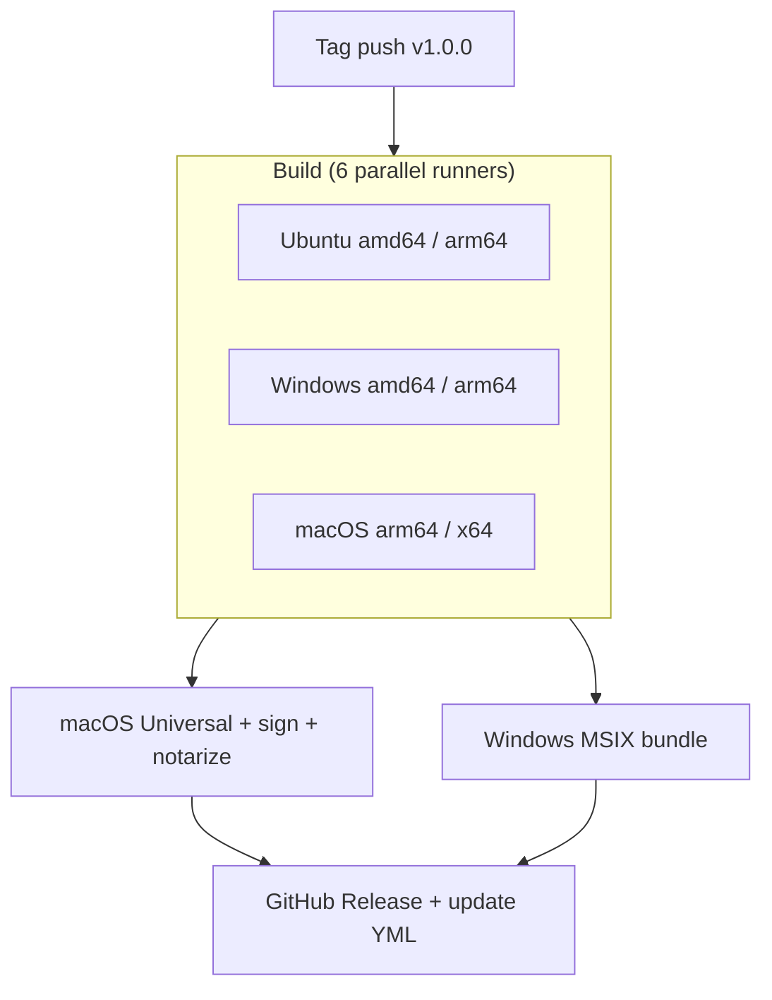

import { Callout } from 'fumadocs-ui/components/callout';

Building, signing, and publishing across three OSes and four architectures by hand is a full-time job. Nucleus ships six composite GitHub Actions that handle the whole pipeline — and a reference release workflow you can `uses:` directly from the Nucleus repo, no copy-paste required.

## TL;DR
- `setup-nucleus` — JBR 25 (or GraalVM Liberica NIK), packaging tools, Gradle, Node, all cross-platform.
- `setup-macos-signing` — temporary keychain + certificate import from secrets.
- `build-macos-universal` — `lipo` merge of arm64 + x64, inside-out re-sign, notarize, staple.
- `build-windows-appxbundle` — combine amd64 + arm64 `.appx` into a `.msixbundle`, sign with SignTool.
- `generate-update-yml` — scan all platform installers, compute SHA-512, emit `latest-*.yml`.
- `publish-release` — `gh release create` with installers + YAML.

## Install
Reference the actions directly from the Nucleus repo:

```yaml
- uses: NucleusFramework/Nucleus/.github/actions/setup-nucleus@main
```

Pin to a tag (`@v2.0.0`) for production.

## Quickstart

```yaml
name: Release
on:
  push:
    tags: ['v*']

permissions:
  contents: write

jobs:
  build:
    strategy:
      matrix:
        include:
          - { os: ubuntu-latest,   arch: amd64 }
          - { os: ubuntu-24.04-arm, arch: arm64 }
          - { os: windows-latest,   arch: amd64 }
          - { os: windows-11-arm,   arch: arm64 }
          - { os: macos-latest,     arch: arm64 }
          - { os: macos-15-intel,   arch: amd64 }
    runs-on: ${{ matrix.os }}
    steps:
      - uses: actions/checkout@v4
      - uses: NucleusFramework/Nucleus/.github/actions/setup-nucleus@main
        with:
          jbr-version: '25.0.2b329.66'
          packaging-tools: 'true'
          flatpak: 'true'
          snap: 'true'
      - run: ./gradlew packageReleaseDistributionForCurrentOS --stacktrace --no-daemon
      - uses: actions/upload-artifact@v4
        with:
          name: release-assets-${{ runner.os }}-${{ matrix.arch }}
          path: build/compose/binaries/main/**/*
```

## How it works

### `setup-nucleus`
Cross-platform environment in a single step. Installs JBR (default) or Liberica NIK (for GraalVM), Linux packaging tools (`xvfb`, `rpm`, `fakeroot`, `patchelf`, `libx11-dev`, `libdbus-1-dev`), optional Flatpak SDK + runtime, optional Snapcraft, Gradle with caching, Node (for electron-builder).

Inputs: `jbr-version`, `jbr-variant`, `jbr-download-url`, `graalvm` (boolean), `graalvm-java-version`, `packaging-tools`, `flatpak`, `snap`, `setup-gradle`, `setup-node`, `node-version`.

GraalVM mode (`graalvm: 'true'`) swaps JBR for Liberica NIK 25, selects Xcode 26 on macOS, and sets up MSVC on Windows via `ilammy/msvc-dev-cmd@v1`.

### `setup-macos-signing`
Imports a base64-encoded `.p12` into a temporary keychain and unlocks it for `codesign`. Outputs identities the universal-binary action consumes.

```yaml
- uses: NucleusFramework/Nucleus/.github/actions/setup-macos-signing@main
  with:
    certificate-base64: ${{ secrets.MAC_CERTIFICATES_P12 }}
    certificate-password: ${{ secrets.MAC_CERTIFICATES_PASSWORD }}
```

Required secrets for end-to-end macOS signing:

| Secret | Purpose |
|--------|---------|
| `MAC_CERTIFICATES_P12` | Base64-encoded `.p12` bundle |
| `MAC_CERTIFICATES_PASSWORD` | `.p12` password |
| `MAC_DEVELOPER_ID_APPLICATION` | Developer ID Application identity |
| `MAC_APP_STORE_APPLICATION` | 3rd Party Mac Developer Application identity |
| `MAC_APP_STORE_INSTALLER` | 3rd Party Mac Developer Installer identity |
| `MAC_PROVISIONING_PROFILE` | Base64 provisioning profile for sandboxed app |
| `MAC_RUNTIME_PROVISIONING_PROFILE` | Base64 provisioning profile for JVM runtime |
| `MAC_NOTARIZATION_APPLE_ID` / `_PASSWORD` / `_TEAM_ID` | Notarization credentials |

### `build-macos-universal`
Takes per-arch `.app` artifacts, merges with `lipo`, re-signs inside-out (`.dylib` and `.jnilib` first with runtime entitlements, then main executables with app entitlements, then runtime, then the bundle), notarizes via `xcrun notarytool`, and staples. Produces a single `MyApp-1.0.0-macos-universal.dmg` and a stapled ZIP. Without `MAC_*` secrets the workflow falls back to ad-hoc signing — same result as unsigned local builds.

### `build-windows-appxbundle`
Combines amd64 and arm64 `.appx` files into a `.msixbundle` via `MakeAppx`, then signs with SignTool. Single artifact for Microsoft Store submission.

### `generate-update-yml`
Walks every uploaded installer, computes SHA-512, and produces `latest-mac.yml`, `latest.yml` (Windows), `latest-linux.yml`. Merges per-architecture artifacts into single YAMLs per platform — the [auto-updater](/docs/packaging/auto-update) consumes them.

### `publish-release` (Release)
Runs `gh release create` with the version tag, the assembled installers, and the YAMLs. Marks pre-release for `*-alpha-*` / `*-beta-*` tags automatically.

### Reference release workflow shape



The full workflow lives at [`.github/workflows/release-desktop.yaml`](https://github.com/NucleusFramework/Nucleus/blob/main/.github/workflows/release-desktop.yaml) in the Nucleus repo. `[FACT-CHECK NEEDED]` — confirm the exact action paths and required secret names against the actions you ship in 2.0.

## Reference

| Action | What it does |
|--------|--------------|
| `setup-nucleus` | JBR/Liberica + tools + Gradle + Node |
| `setup-macos-signing` | Temporary keychain from base64 P12 |
| `build-macos-universal` | lipo merge + inside-out sign + notarize |
| `build-windows-appxbundle` | MakeAppx + SignTool |
| `generate-update-yml` | SHA-512 metadata for auto-update |
| `publish-release` | `gh release create` |

## Notes

- No cross-compilation. Each OS/arch installer must be built on a matching runner.
- For 2.x prereleases, tag from `nucleus-2.0` with `v2.x.y-alpha-*`, `-beta-*`, or `-rc-*`. CI validates the tag points to a commit on that branch.
- See [code signing](/docs/packaging/code-signing) for the secret-management playbook and [publishing](/docs/packaging/publishing) for the DSL that drives publish targets.
